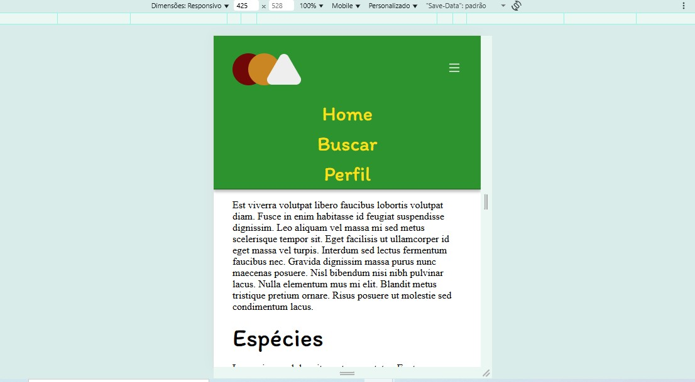

 🍌 **Landing Page Fruits**

> 🌿 Uma landing page moderna e colorida sobre frutas, desenvolvida com **HTML, CSS e JavaScript**, inspirada nas aulas do curso **[Dev de Verdade – Frontend Básico (CSS)]**

> 🍍 Projeto criado para praticar **layout responsivo**, **transições suaves** e **interatividade com menu mobile**.

---

## 📑 **Índice**

* [👀 Visão Geral](#-visão-geral)

  * [🧩 O Projeto](#-o-projeto)
  * [🖼️ Capturas de Tela](#️-capturas-de-tela)
  * [🔗 Links](#-links)
* [💡 Meu Processo](#-meu-processo)

  * [🛠️ Tecnologias Utilizadas](#️-tecnologias-utilizadas)
  * [🚀 Desenvolvimento Contínuo](#-desenvolvimento-contínuo)
* [🙋‍♂️ Autor](#-autor)
* [📝 Licença](#-licença)

---

## 👀 **Visão Geral**

### 🧩 O Projeto

Os usuários devem ser capazes de:

✅ Visualizar o site corretamente em **diferentes tamanhos de tela** (layout responsivo)
✅ Interagir com o **menu mobile**, que aparece e desaparece ao clicar no ícone
✅ Ver um **efeito de zoom** ao passar o mouse nas frutas e imagens
✅ Navegar por uma estrutura limpa, moderna e organizada

> 💬 Este projeto foi baseado no modelo proposto pelo curso Dev de Verdade,
> mas com **melhorias próprias** — incluindo o **zoom nas imagens** e **layout totalmente responsivo**, que **não faziam parte do exercício original**.

---

### 🖼️ **Capturas de Tela**

#### 📱 Versão Mobile

#### 🖼️ Versão Desktop

---

### 🔗 **Links**

* 🌐 **Site publicado:**
  👉 [https://dhBarankievicz.github.io/landing-page-fruits/](https://dhBarankievicz.github.io/landing-page-fruits/)

* 💾 **Repositório no GitHub:**
  👉 [https://github.com/dhBarankievicz/landing-page-fruits](https://github.com/dhBarankievicz/landing-page-fruits)

---

## 💡 **Meu Processo**

### 🛠️ **Tecnologias Utilizadas**

* 🧱 **HTML5** – Estrutura semântica e organizada
* 🎨 **CSS3** – Estilização, transições e responsividade com media queries
* ⚙️ **JavaScript Vanilla** – Controle do menu mobile com eventos e animação de opacidade
* 🔤 **Google Fonts:** *Itim* e *Inria Sans*

---

### 🚀 **Desenvolvimento Contínuo**

Durante o desenvolvimento deste projeto, pude aplicar e expandir conceitos fundamentais:

✨ Adicionei **efeito de zoom** suave com `transform: scale()`
📱 Implementei **responsividade completa** com `@media queries`
🎯 Usei **Flexbox** para alinhar seções e distribuir conteúdo
🧠 Melhorei o **menu mobile** com transições suaves via `opacity` e `pointer-events`

---

## 🙋‍♂️ **Autor**

**👨‍💻 [Douglas Barankievicz]**
Desenvolvido com base no curso **Dev de Verdade – Frontend Básico (CSS)**.

🔗 [GitHub](https://github.com/dhBarankievicz)
🔗 [LinkedIn](https://linkedin.com/in/douglas-barankievicz-a42132358)

---

## ⭐ **Futuramente: refazer o projeto usando TailwindCSS para experimentar utility-first CSS e agilizar estilização**

